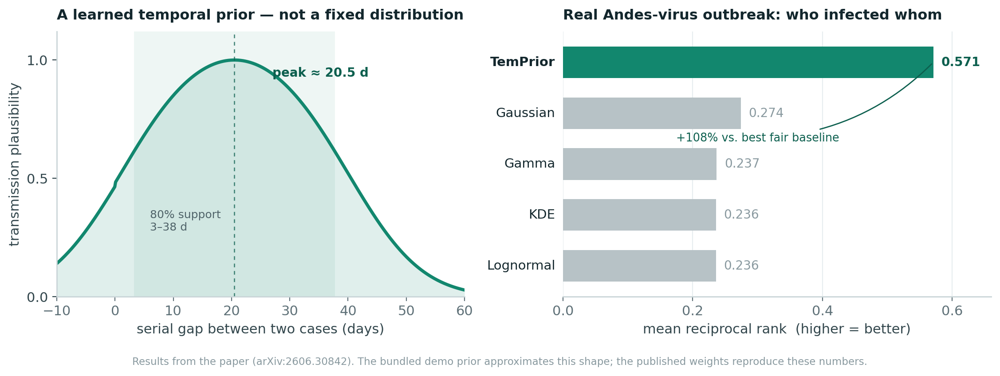

<div align="center">

# TemPrior

**Infer who-infected-whom in an outbreak from symptom-onset timing — no genome sequencing required.**

[](https://pypi.org/project/temprior/)
[](https://pypi.org/project/temprior/)
[](https://github.com/01ahsan/TemPrior/actions)
[](LICENSE)
[](https://arxiv.org/abs/2606.30842)
[](https://01ahsan.github.io/TemPrior)

<br>



</div>

At the start of an outbreak, contact tracers need to know who infected whom — but genome sequencing takes days and needs multiple high-quality sequences per case, which are often unavailable. TemPrior recovers the transmission chain from case **timing** alone.

The method learns a temporal prior over serial intervals from many past outbreaks, **locks it before it ever sees the target outbreak**, and ranks each case's most likely infector zero-shot. Unlike parametric serial-interval methods, it is not committed to a Gaussian or Gamma shape; and unlike most reconstruction tools, it treats epidemiological links as what they are — uncertain — and quantifies how that uncertainty shifts the cases you would prioritise for isolation.

**→ [Try it in your browser](https://01ahsan.github.io/TemPrior)** — reconstruct an outbreak live, drag cases to re-time them, upload your own line list. Nothing leaves the page.

## Results

On real Andes-virus (ANDV) outbreak data, the locked prior ranks the true infector first-or-near-first far more often than any serial-interval baseline fit to the same source data:

| Method | MRR | Top-1 | Top-3 |
| :-- | :-- | :-- | :-- |
| **TemPrior** | **0.571** | **0.379** | **0.759** |
| Gaussian | 0.274 | 0.138 | 0.207 |
| Gamma | 0.237 | 0.103 | 0.172 |
| KDE / Lognormal | 0.236 | 0.103 | 0.172 |

The improvement is significant under permutation (*p* ≤ 0.0002) and robust to leave-one-out perturbation. It is also **regime-specific by design**: the advantage concentrates in the 16–40 day serial-gap window that fixed parametric priors systematically underweight. In short-gap settings (household COVID-19, ~3–5 days) a fitted Gaussian is competitive, and TemPrior does not claim otherwise.

## Install

```bash
pip install temprior
```

Pure Python (NumPy / SciPy / pandas / scikit-learn), Python ≥ 3.9.

## Usage

Rank candidate infectors for every case in a line list:

```python
import temprior as tp

linelist, edges = tp.make_example_outbreak()          # or your own DataFrames
benchmark = tp.build_benchmark(linelist, edges)       # Algorithm 1
prior = tp.default_prior()

for task in benchmark[:3]:
    infector, plausibility, _ = tp.rank_candidates(prior, task.gaps, task.candidates)[0]
    print(f"case {task.target}: most likely infector = case {infector} ({plausibility:.2f})")
```

Score the prior against fair, source-trained baselines:

```python
scores = {"TemPrior": prior, **tp.fit_baselines(source_gaps)}
for name, s in scores.items():
    print(name, tp.evaluate(s, benchmark).as_dict())
```

Quantify label uncertainty and its effect on triage decisions:

```python
cats = tp.categorize_labels(edges["confidence"].tolist())
inst = tp.decision_instability(*tp.expand_edges(strict_edges, plausible_edges), k=5)
print(cats["unresolved_fraction"], inst.jaccard, inst.decision_regret)
```

Or from the command line, on your own CSVs:

```bash
temprior rank        --linelist cases.csv --edges edges.csv --out ranked.csv
temprior evaluate    --linelist cases.csv --edges edges.csv
temprior uncertainty --edges edges.csv --k 5
```

## Data format

A **line list** — one row per case, `onset` as a day number or a date:

```
case_id,onset
P1,2024-01-03
P2,2024-01-26
```

An **edge list** — the documented links, with an optional confidence in `[0,1]`:

```
parent_id,child_id,confidence
P1,P2,0.91
```

Edges are optional: `temprior rank` will otherwise score every case against all admissible earlier cases.

## How it works

Each ordered pair of cases becomes a candidate transmission with a signed onset gap. A logistic model over gap features scores each candidate; trained by leave-one-disease-out across a multi-disease benchmark, its shape is nearly invariant to which disease is held out (mean cross-fold correlation 0.99), which is why it transfers. The prior is then frozen — `fit()` raises on a locked prior — so evaluation on a new outbreak is genuinely zero-shot, never refit to the target. Uncertainty is handled separately: documented links are graded strict → plausible, and the top-*k* source shortlist is recomputed under each grade to measure how many priority decisions actually change.

| Module | Paper element |
| :-- | :-- |
| `benchmark.py` | Algorithm 1 — candidate-infector benchmark construction |
| `prior.py` | Learned temporal prior; locking protocol |
| `evaluate.py` | Algorithm 2 — MRR / Top-*k* / NDCG evaluation |
| `baselines.py` | Fair source-trained Gaussian / KDE / Gamma / Lognormal |
| `uncertainty.py` | Label grading, edge expansion, top-*k* decision instability |

## Using your own locked prior

The bundled `default_prior()` reproduces the published prior's *shape*; the exact study weights reproduce the numbers above. To train and lock your own:

```python
prior = tp.TemporalPrior().fit(source_gaps, labels)
prior.lock()                      # zero-shot protocol, enforced in code
prior.save("prior.json")          # reload anywhere, no scikit-learn needed at inference
```

## Citation

```bibtex
@misc{karim2026temprior,
  title  = {A Transferable Learned Temporal Prior for Transmission Reconstruction
            and Decision-Relevant Uncertainty in Real Outbreak Labels},
  author = {Karim, Md Ahsan},
  year   = {2026},
  eprint = {2606.30842},
  archivePrefix = {arXiv},
  primaryClass  = {cs.LG},
  url    = {https://arxiv.org/abs/2606.30842}
}
```

Contributions welcome — see [CONTRIBUTING.md](CONTRIBUTING.md). Licensed MIT © 2026 Md Ahsan Karim.
